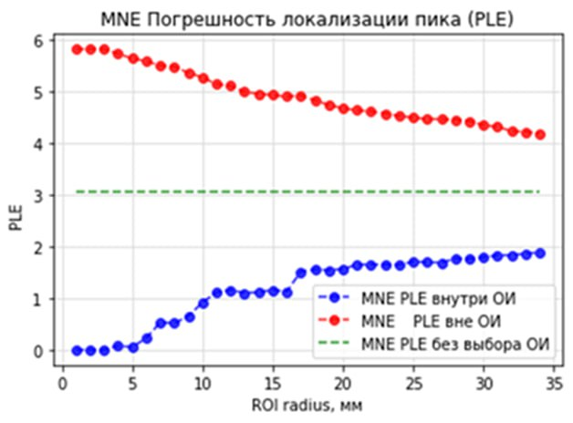

# Расчет пространственного разрешения при решении обратной задачи ЭЭГ с использованием ковариационной матрицы

Для оценки использовались метрики погрешности локализации пика и пространственного отклонения.
В работе оценивается влияние пространственной фильтрации на основе ковариационной матрицы на пространственное разрешение метода нейровизуализации
Расчеты проводились с использованием библиотеки MNE-tools

Как видно из рисунка, пространственное разрешение, при использовании пространственной фильтрации, снижается вдвое
